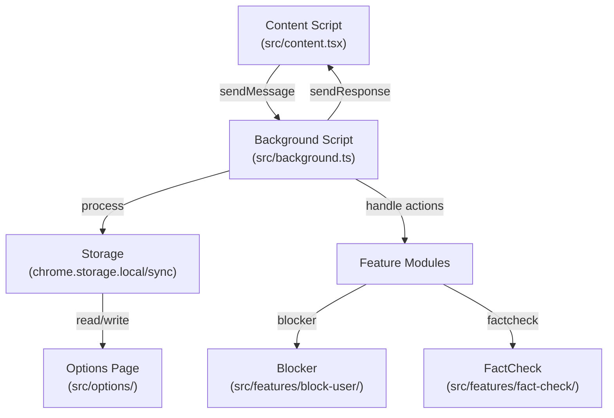

# Developer Documentation

> For a high-level overview, see [README.md](./README.md). This file covers architecture, project structure, and contributor guidance.

## Architecture



## How It Works

1. **Detection**: Content script looks for Zhihu user links
2. **Injection**: Adds Block/Fact Check buttons next to user names
3. **Storage**: Blocked users saved to Chrome storage (syncs across devices)
4. **Hiding**: Blocked content hidden via CSS (`display: none`)
5. **Management**: Options page lets you view and manage blocked users

## Project Structure

```
src/
├── background.ts    # Extension background logic
├── content.tsx      # Content script (injects into web pages)
├── options/         # User settings page
├── features/        # Feature modules
│   ├── block-user/  # User blocking functionality
│   └── fact-check/  # AI fact-checking
├── components/      # Shared UI components
├── hooks/           # Custom React hooks
├── types/           # TypeScript type definitions
└── test/            # Test setup utilities

e2e/                 # End-to-end tests
```

## Storage

- **Blocked users**: Stored in `chrome.storage.sync` under key `zhihuBlockedUsers` as an array of user objects. Syncs across all Chrome devices.
- **Fact-check configs**: Stored under key `factCheckConfigs` as an ordered array of provider configs (each with `provider`, `apiKey`, `model`, `baseUrl`, `language`). The first entry is the primary provider; subsequent entries are fallbacks. A legacy single `factCheckConfig` key is still read for backward compatibility.
- **Logs**: Stored in `chrome.storage.local` under key `extensionLogs`.

## Security & Privacy

- **Local storage**: User data stored in your Chrome account
- **Secure messaging**: Background script handles all communication
- **Shadow DOM**: Extension styles isolated to prevent page contamination

## CI/CD

The project uses GitHub Actions for:

- **CI**: Runs tests and builds on every PR
- **Release**: Automated releases with version bumping
- **Conventional commits**: Automated version management

## Development Commands

```bash
npm run dev        # Development mode
npm run build      # Build for production
npm run preview    # Preview built extension
npm test           # Run tests
npm run test:watch # Watch mode for tests
```

## Human Developer Notes

### Important Patterns

- Feature organization: All feature code lives under `src/features/` with each feature in its own subdirectory
- Feature boundaries: Keep blocking and fact-checking completely separate (different directories, hooks, components)
- Context script: All UI injection must use React portals with Shadow DOM for style isolation
- Background script: Service worker only handles message routing; never access DOM from background
- Storage keys: Use `chrome.storage.sync` for user config (blocked users, provider configs); use `chrome.storage.local` for logs

### Common Gotchas

- Do not access `window` or `document` in background.ts (service worker context has no DOM)
- Message handlers must validate `sender.origin` for security
- React components in content scripts require Shadow DOM wrapper to avoid page CSS bleeding
- Fact-check provider calls are async and may take 30+ seconds; always show loading state
- When adding new tests, mock `chrome.*` APIs with `src/test/setup.ts` helpers

### Development Tips

- Use `npm run dev` for live reloading; changes to content scripts require page refresh
- Debug content scripts via Chrome DevTools on the Zhihu page (not extension popup)
- Debug background service worker in `chrome://extensions` → service worker link
- Check extension logs via Options page LogViewer or `chrome.storage.local` → `extensionLogs`

---

## Reference Links

- [README.md](./README.md) - High-level project summary, features, quick start, user setup
- [CLAUDE.md](./CLAUDE.md) - AI development rules and constraints