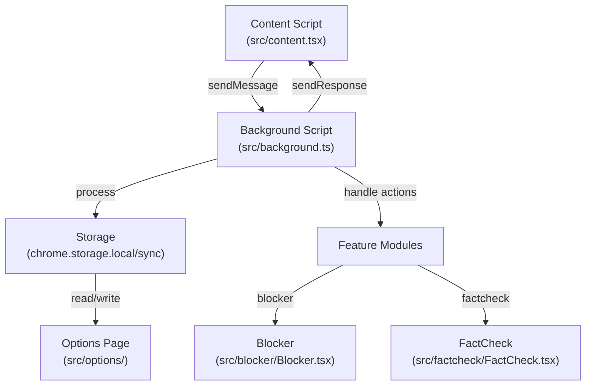

# Architecture Overview

## Data Flow

## Storage
- **chrome.storage.local**: Logs and cached data
- **chrome.storage.sync**: User preferences and blocked users list (`zhihuBlockedUsers`)

## Message Flow
1. **User Action** → Content Script receives event  
2. **Message** → Content Script sends message to Background Script  
3. **Processing** → Background Script processes request  
4. **Storage** → Background Script reads/writes to chrome.storage  
5. **Response** → Background Script sends response back  
6. **Update** → Content Script updates UI  

## Testing
- **Unit/Integration**: Vitest (`src/**/*.test.ts`)  
- **End-to-End**: Playwright (`e2e/extension.spec.ts`)  

## Key Files
- `manifest.json`: Extension configuration  
- `vite.config.ts`: Build configuration  
- `src/background.ts`: Service worker logic  
- `src/content.tsx`: Content script entry point  
- `src/blocker/Blocker.tsx`: Blocking UI component  
- `src/options/Options.tsx`: Options page UI  
- `src/factcheck/FactCheck.tsx`: Fact-checking UI component